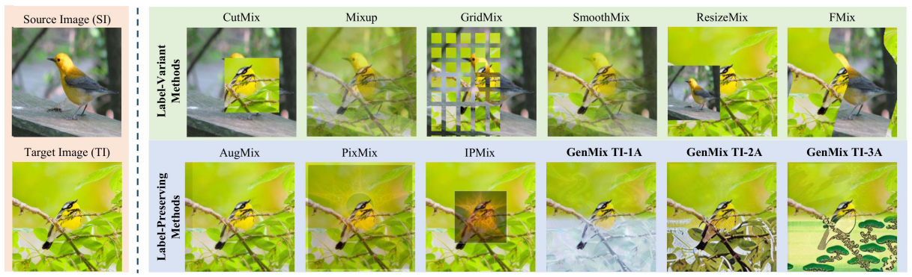

# GenMix : Effective Data Augmentation with Generative Diffusion Model Image Editing (arXiV'2026)

[](https://www.linkedin.com/in/khawarislam/)
[](https://www.linkedin.com/in/khawarislam/)
[](https://www.linkedin.com/in/khawarislam/)
[](https://www.linkedin.com/in/khawarislam/)


<p align="center">
    
</p>

---

## 📢 Latest Updates
- **Jan-08-26**: GenMix paper is released [arxiv link](https://www.linkedin.com/in/khawarislam/). 🔥🔥

## 🚀 Getting Started
Setup anaconda environment using `environment.yml` file.

```
conda env create --name GenMix --file=environment.yml
conda remove -n GenMix --all # In case environment installation faileds
```

## 📝 List of Prompts 
Below is the list of prompts, if your accuracy is low then you can use all prompts to increase the performance. Remember that each prompt takes a time to generate images, so the best way is to start from two prompts then increase the number of prompts.

```
prompts = ["Autumn", "snowy", "watercolor art","sunset", "rainbow", "aurora",
               "mosaic", "ukiyo-e", "a sketch with crayon"]
```

## 📁 Dataset Structure
```
train
 └─── class 1
          └───── n04355338_22023.jpg
 └─── class 2
          └───── n03786901_5410.jpg
 └─── ...
```
## ✨ GenMix Augmentation
To introduce the structural complexity, you can download fractal image dataset from here [Fractal Dataset](https://drive.google.com/drive/folders/19xNHNGFv-OChaCazBdMOrwdGRsXy2LPs/)
```
`python3 main.py --train_dir PATH[train](../datasets/original_dataset/CUB/train) --fractal_dir PATH[deviantart](../../CM_24/khawar/IPMix/IPMix-set/deviantart) --prompts "Autumn, snowy, watercolor art,sunset, rainbow, aurora, mosaic, ukiyo-e, a sketch with crayon"
```

## 💬 Citation
If you find our work useful in your research please consider citing our paper:
```
@article{islam2024genmix,
  title={Genmix: effective data augmentation with generative diffusion model image editing},
  author={Islam, Khawar and Zaheer, Muhammad Zaigham and Mahmood, Arif and Nandakumar, Karthik and Akhtar, Naveed},
  journal={arXiv preprint arXiv:2412.02366},
  year={2024}
}

@inproceedings{islam2024diffusemix,
  title={Diffusemix: Label-preserving data augmentation with diffusion models},
  author={Islam, Khawar and Zaheer, Muhammad Zaigham and Mahmood, Arif and Nandakumar, Karthik},
  booktitle={Proceedings of the IEEE/CVF Conference on Computer Vision and Pattern Recognition},
  pages={27621--27630},
  year={2024}
}

```
